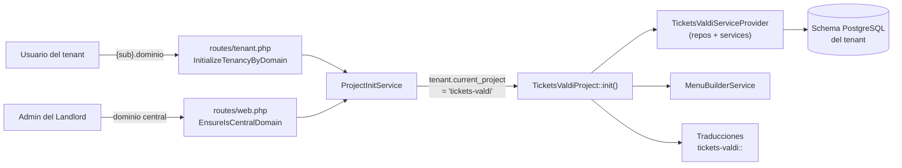
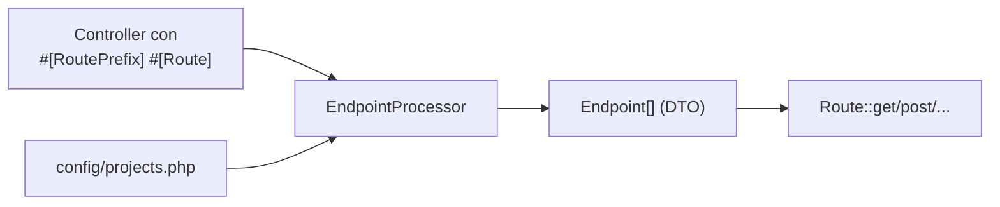
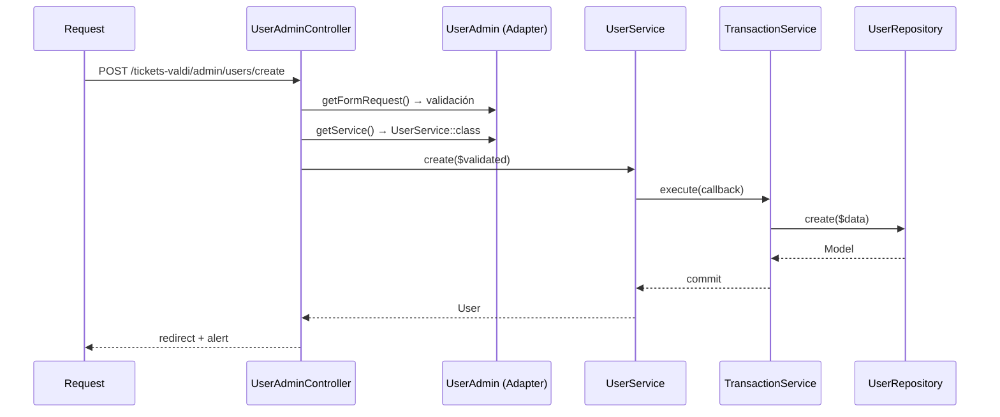

# Architecture

Cómo está construido TicketsValdi y cómo se engancha con la plataforma multi-tenant.
Para los patrones transversales (Repository, Service Layer, FormBuilder, ListViewConfig)
ver `docs/` en la raíz del repositorio.

## Context



El proyecto **no elige** cuándo activarse: `ProjectInitService` lee
`tenant.current_project`, resuelve la clase vía `ProjectManager::getProject()` y llama a
`init()`. Registrarse en `ProjectManager` es lo que hace que el proyecto aparezca en el
selector al crear un tenant.

## Registration points

Cuatro registros, ninguno deducible de los otros. **Al agregar un controller hay que
revisar los cuatro.**

| # | Archivo | Qué habilita | Si falta |
|---|---|---|---|
| 1 | `app/ProjectManager.php` | Proyecto seleccionable en el alta de tenants; resolución de la carpeta de migraciones | El proyecto no existe para la plataforma |
| 2 | `config/projects.php` → `tickets-valdi` | `EndpointProcessor` sabe qué controllers escanear | `getEndpoints()` devuelve vacío |
| 3 | `routes/tenant.php` | Rutas en subdominios de tenant — **el registro que importa en producción** | 404; `route()` lanza excepción |
| 4 | `routes/web.php` | Rutas en dominio central (paridad con los otros proyectos) | 404 solo en dominio central |

> `routes/api-auth.php` es un quinto punto que **hoy no aplica**: registra los endpoints
> `api/*` fuera del middleware `web` (stateless). Hay que sumar el proyecto ahí recién
> cuando existan controllers `Http/Controller/Api/`.

El test `itsEndpointsAreRegisteredAsApplicationRoutes` verifica que todo endpoint generado
esté en el router, así que cubre los puntos 2-4 automáticamente.

## Routing

Las rutas **no se declaran**: se derivan por reflexión de atributos PHP 8.



El nombre resultante es `{projectPrefix}.{classPrefix}.{actionName}`:

| Nombre | Método | URI |
|---|---|---|
| `tickets-valdi.auth.login` | GET | `/tickets-valdi/auth/login` |
| `tickets-valdi.auth.login.post` | POST | `/tickets-valdi/auth/login` |
| `tickets-valdi.auth.logout` | POST | `/tickets-valdi/auth/logout` |
| `tickets-valdi.admin.users.list` | GET | `/tickets-valdi/admin/users/list` |
| `tickets-valdi.admin.users.create` | GET, POST | `/tickets-valdi/admin/users/create` |
| `tickets-valdi.admin.users.edit` | GET, PUT | `/tickets-valdi/admin/users/edit/{id}` |
| `tickets-valdi.admin.users.delete` | GET, DELETE | `/tickets-valdi/admin/users/delete/{id}` |

Las constantes viven en `Enums/Routes.php`. **Usar siempre el enum**, nunca el string.

## Building blocks

```
app/Projects/TicketsValdi/
├── TicketsValdiProject.php          # ProjectInterface: init(), prefix, migraciones, lang
├── CLAUDE.md                        # Contexto para agentes
├── docs/                            # Esta documentación
├── Providers/
│   └── TicketsValdiServiceProvider.php   # Registra repos en RepositoryManager + binds
├── Enums/Routes.php                 # Nombres de ruta como constantes
├── Models/User.php                  # Extiende App\Models\User
├── Repositories/UserRepository.php  # Extiende BaseRepository
├── Services/
│   ├── MenuBuilderService.php       # Menú lateral del proyecto
│   └── Model/UserService.php        # Escrituras envueltas en TransactionService
├── FormRequests/UserFormRequest.php # Validación + definición del formulario
├── Adapters/Admin/UserAdmin.php     # Config del CRUD (columnas, stats, acciones)
└── Http/Controller/
    ├── Auth/AuthController.php      # Extiende BaseAuthController
    └── Admin/UserAdminController.php # Extiende AdminController
```

### Request flow (escritura)



Si un Adapter devuelve `getService()`, `AdminController` usa el Service (con transacción);
si no, cae al Repository directo sin transacción.

## Authentication

- Guard **`web`** — los usuarios viven en la tabla `users` del schema del tenant.
- El guard `landlord` es para el panel de administración de tenants; **no usarlo acá**
  (ver [ADR 0002](./decisions/0002-use-web-guard-for-tenant-users.md)).
- Middleware disponible para controllers del proyecto: `auth.tenant`, `auth.system_user`,
  `cache.user.roles`.

## Data

Ver [DOMAIN.md](./DOMAIN.md#data-model) para el modelo ER.

Cada tenant tiene su propio schema PostgreSQL. Las migraciones corren en dos tandas:

```
1. database/migrations/projects/Common/       → users, cache, jobs, permisos,
                                                 personal_access_tokens, activity_log
2. database/migrations/projects/TicketsValdi/ → (vacía — ADR 0001)
```

Al sumar tablas propias:

```bash
touch database/migrations/projects/TicketsValdi/2026_01_01_000001_create_tickets_table.php
php artisan tenants:migrate-project --project=tickets-valdi
```

Ver `docs/14-migrations-por-proyecto.md` en la raíz para los flags disponibles
(`--tenant`, `--common`, `--fresh`, `--seed`).

## Risks and technical debt

| Riesgo | Impacto | Mitigación |
|---|---|---|
| Los 4 puntos de registro son manuales | Un controller nuevo puede quedar sin ruta y fallar recién en runtime | El test de rutas lo detecta en CI |
| `ProjectManager::$currentProject` es estático y no se resetea entre tests | Tests que pasan aislados y fallan en suite (ya ocurre en `TenantFilterTest`) | Preexistente; evitar depender del proyecto activo en tests nuevos |
| `DOMAIN.md` va por delante del código | El doc puede describir reglas no implementadas | Cada sección indica su estado (`implemented` / `TBD`) |
