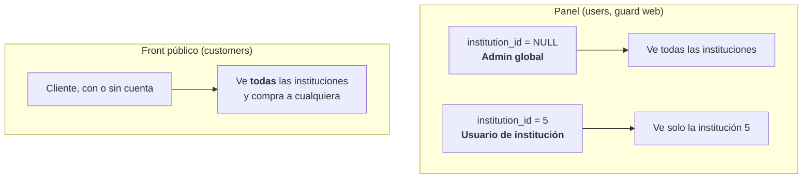
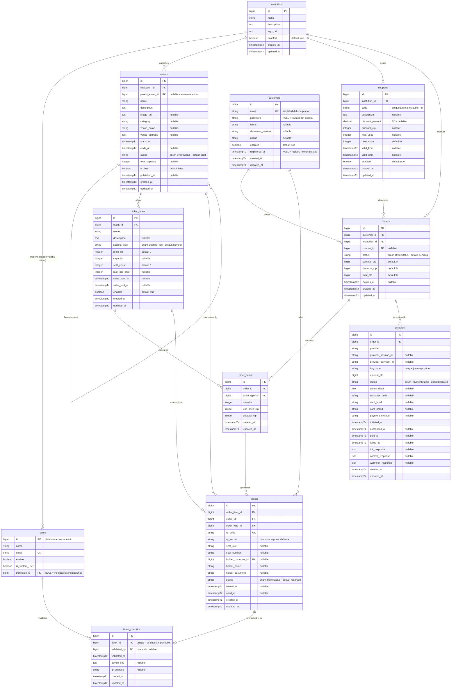
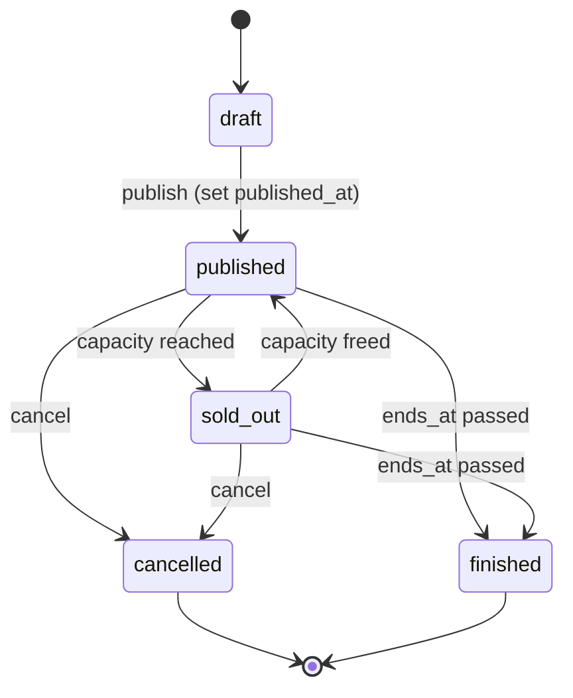
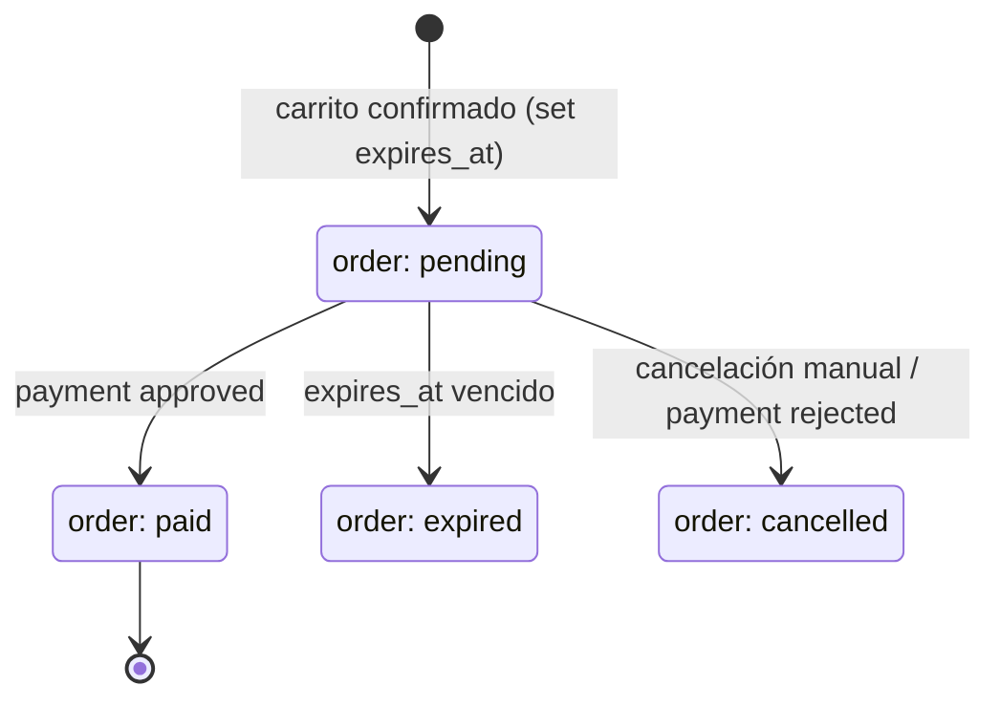
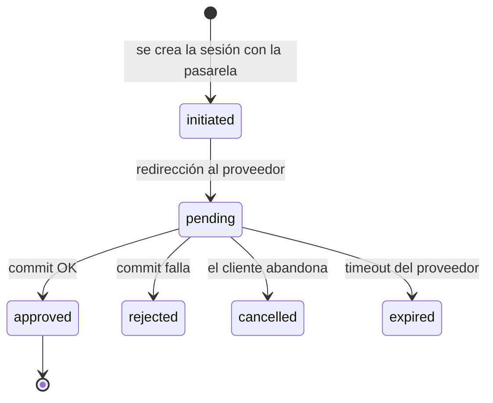
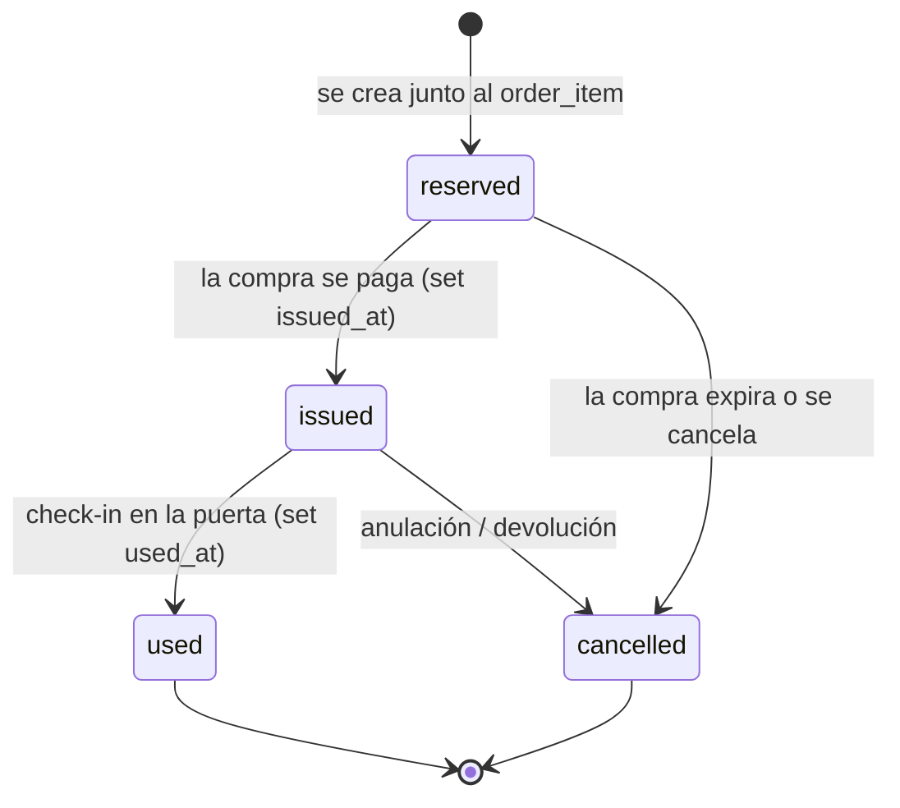

# Domain

Reglas de negocio y modelo de datos de TicketsValdi: **venta y validación de entradas para
eventos**.

Una institución publica eventos; cada evento ofrece uno o más tipos de entrada con precio y
capacidad; un cliente arma una compra, paga a través de una pasarela y recibe tickets con
código QR; en la puerta, un validador escanea el QR y registra el check-in.

> **Estado: esquema implementado, lógica pendiente.** Las 11 migraciones existen en
> `database/migrations/projects/TicketsValdi/`. Los modelos, servicios y pantallas no.
> Ante una diferencia entre este doc y la implementación, **manda este doc**.

| Sección | Estado |
|---|---|
| [Ubiquitous language](#ubiquitous-language) | ✅ definido |
| [Visibility model](#visibility-model) | ✅ definido |
| [Data model](#data-model) | ✅ migraciones creadas |
| [Enumerations](#enumerations) | ✅ definido, sin implementar como enums PHP |
| [Lifecycles](#lifecycles) | 🟡 inferido del esquema — requiere confirmación |
| [Business rules](#business-rules) | 🟡 inferidas del esquema — requieren confirmación |
| [Permissions](#permissions) | 🟡 roles definidos, capacidades por confirmar |
| [Open questions](#open-questions) | 🟡 3 resueltas, 7 abiertas |

## Ubiquitous language

El modelo se especificó originalmente en español. **El código va en inglés**: nombres de
tablas, columnas, modelos y enums. Esta tabla es la traducción canónica — usarla siempre,
no improvisar sinónimos.

| Español (origen) | Inglés (canónico) | Definición |
|---|---|---|
| Institución | **Institution** | Organización que publica eventos y vende entradas |
| Usuario admin | **User** | Persona que opera el panel. Es la tabla `users` de la plataforma |
| Cliente | **Customer** | Comprador de entradas. Entidad separada de `User` |
| Cliente invitado | **Guest customer** | `Customer` creado desde el checkout con solo su email, sin contraseña. Puede registrarse después sin perder su histórico |
| Evento | **Event** | Función o espectáculo con fecha, recinto y aforo |
| Tipo de ticket | **Ticket type** | Categoría de entrada de un evento, con precio y capacidad propios |
| Cupón | **Coupon** | Código de descuento por institución |
| Compra | **Order** | Carrito confirmado por un cliente: totales, cupón y vencimiento |
| Detalle de compra | **Order item** | Línea de una compra: N entradas de un tipo a un precio |
| Pago | **Payment** | Intento de cobro contra una pasarela externa |
| Ticket | **Ticket** | Entrada individual con QR. Es lo que se valida en la puerta |
| Check-in | **Ticket check-in** | Registro del escaneo del QR al ingresar |
| Validador | **Validator** | Rol que escanea entradas en el acceso |
| Aforo | **Capacity** | Cupo máximo (del evento o de un tipo de entrada) |

## Visibility model

**Todas las instituciones conviven en el mismo schema.** No hay separación física entre
ellas: el aislamiento por schema que provee la plataforma es por *tenant*, y dentro del
tenant las instituciones comparten todas las tablas. La visibilidad se resuelve por
aplicación, no por base de datos.

Las dos audiencias ven cosas distintas:

| Quién | Alcance |
|---|---|
| `users.institution_id` **NULL** | Admin del landlord / `super_admin`: ve y opera todas las instituciones |
| `users.institution_id` **seteado** | Opera únicamente su institución. Toda consulta del panel se filtra por esa FK |
| `customers` | Catálogo completo: navegan y compran en cualquier institución del tenant |

Consecuencia importante: **una compra vincula un cliente con una institución a la que no
pertenece**. `orders.customer_id` y `orders.institution_id` son independientes entre sí —
el cliente no es "de" la institución, solo le compró.

Ver [ADR-0005](./decisions/0005-institution-scope-on-platform-users.md).

## Data model

### Platform-provided (no redefinir)

Las crean las migraciones de `database/migrations/projects/Common/` en cada schema de
tenant. **No son parte del dominio**:

- `users` — usuarios del panel (guard `web`)
- `roles`, `permissions`, `model_has_roles`, `model_has_permissions`,
  `role_has_permissions` — **spatie/laravel-permission**
- `activity_log` — auditoría
- `cache`, `jobs`, `personal_access_tokens`

El modelo original traía una tabla `usuarios_admin` con columna `rol`. **No se crea**: sus
usuarios son la tabla `users` de la plataforma y el rol sale de spatie
(ver [ADR-0004](./decisions/0004-reuse-platform-users-for-admins.md)).

El pivote `admin_institucion` **tampoco se crea**: un usuario pertenece a una sola
institución, así que se resuelve con una FK `institution_id` nullable agregada a `users`
([ADR-0005](./decisions/0005-institution-scope-on-platform-users.md)).

`customers` sí es tabla propia: son compradores que no acceden al panel y tienen datos que
`users` no modela (documento, teléfono).

### Type mapping

Reglas aplicadas al traducir el modelo original:

| Origen | Acá | Por qué |
|---|---|---|
| `uuid [pk]` | `bigint PK` autoincremental | Decisión explícita: IDs incrementales con secuencia ([ADR-0003](./decisions/0003-sequential-bigint-identifiers.md)) |
| `creado_en` / `actualizado_en` | `created_at` / `updated_at` | Convención Laravel (`$table->timestamps()`) |
| *(tablas sin timestamps)* | **todas** llevan `created_at` y `updated_at` | Requisito transversal: ninguna tabla sin ambos |
| Tipos `Enum` de PostgreSQL | `varchar` + backed enum de PHP | Agregar un valor a un enum nativo de PG requiere migración con lock; un `varchar` casteado no |
| `hash_password` | `password` | Convención Laravel |
| `activo` | `enabled` | Consistencia con la tabla `users` existente |
| `timestamptz` | `timestampTz` | Se conserva la zona horaria; los tenants tienen `timezone` propio |
| `numeric(5,2)` | `decimal(5,2)` | Equivalente en Laravel |
| Montos `_clp` | `integer` / `bigint` | El peso chileno no usa decimales; se guarda el entero, nunca float |

### ER diagram

### Indexes and constraints

| Tabla | Restricción | Propósito |
|---|---|---|
| `users` | FK `institution_id` nullable → `institutions` | Alcance de visibilidad; NULL = admin global |
| `coupons` | unique `(institution_id, code)` | El código es único por institución, no global |
| `payments` | unique `(provider, buy_order)` | Idempotencia contra la pasarela: evita doble procesamiento de un webhook |
| `tickets` | unique `qr_code` | El QR identifica al ticket |
| `tickets` | unique `(event_id, ticket_type_id, seat_row, seat_number)` | Un asiento numerado no se vende dos veces. **Ojo**: en PostgreSQL los `NULL` no colisionan, así que la restricción no aplica a entradas generales (que dejan ambos campos nulos) — que es el comportamiento buscado |
| `ticket_checkins` | unique `ticket_id` | Un ticket se valida una sola vez |
| `customers` | unique `email` | **Identidad del comprador**: permite reconocer a un invitado recurrente y vincularle el histórico cuando se registre |

## Enumerations

Se implementan como backed enums de PHP (`string`) y se persisten en columnas `varchar`.

### EventStatus

| Valor | Español original | Significado |
|---|---|---|
| `draft` | borrador | En edición, no visible al público |
| `published` | publicado | Visible y a la venta |
| `cancelled` | cancelado | Suspendido; habilita política de devolución |
| `finished` | finalizado | Ya ocurrió |
| `sold_out` | agotado | Sin cupo disponible |

### SeatingType

| Valor | Español original | Significado |
|---|---|---|
| `numbered` | numerado | Asiento asignado (`seat_row` + `seat_number`) |
| `general` | general | Sin asiento asignado |

### OrderStatus

| Valor | Español original |
|---|---|
| `pending` | pendiente |
| `paid` | pagada |
| `cancelled` | cancelada |
| `expired` | expirada |

### PaymentStatus

| Valor | Español original |
|---|---|
| `initiated` | iniciado |
| `pending` | pendiente |
| `approved` | aprobado |
| `rejected` | rechazado |
| `cancelled` | cancelado |
| `expired` | expirado |

### TicketStatus

| Valor | Español original | Significado |
|---|---|---|
| `reserved` | reservado | La compra existe pero no está pagada |
| `issued` | emitido | Pagado y válido para ingresar |
| `used` | usado | Ya se hizo check-in |
| `cancelled` | cancelado | Anulado |

### Roles (spatie)

| Rol | Español original | Alcance |
|---|---|---|
| `super_admin` | super_admin | Todas las instituciones del tenant (`users.institution_id` NULL) |
| `institution_admin` | admin_institucion | Solo su institución (`users.institution_id` seteado) |
| `validator` | validador | Solo check-in de tickets, dentro de su institución |

## Lifecycles

> 🟡 Inferidos del esquema. **Requieren confirmación** — ver [Open questions](#open-questions).

### Event

### Order + Payment

### Ticket

## Business rules

> 🟡 Inferidas del esquema. Las marcadas ⚠️ son suposiciones que **hay que confirmar antes
> de implementar**. Cada regla debería terminar con un test que la cubra.

| # | Regla | Confianza |
|---|---|---|
| BR-1 | Un usuario solo accede a datos de su propio tenant (aislamiento por schema) | ✅ plataforma |
| BR-2 | Un usuario del panel con `institution_id` seteado solo ve y opera datos de esa institución; con `institution_id` NULL ve todas | ✅ confirmada |
| BR-2b | Un cliente ve el catálogo de **todas** las instituciones y puede comprar a cualquiera | ✅ confirmada |
| BR-2c | Una orden vincula un cliente con una institución a la que no pertenece: `customer_id` e `institution_id` son independientes | ✅ confirmada |
| BR-3 | Un evento solo es visible al público con `status = published` y `published_at` seteado | ⚠️ inferida |
| BR-4 | No se venden entradas de un tipo fuera de la ventana `sales_start_at` … `sales_end_at` | ⚠️ inferida |
| BR-5 | `sold_count` nunca supera `capacity` en `ticket_types` | ⚠️ inferida |
| BR-6 | La suma de entradas vendidas de un evento no supera `total_capacity` | ⚠️ inferida |
| BR-7 | `quantity` de un `order_item` no supera `max_per_order` del tipo de entrada | ⚠️ inferida |
| BR-8 | `subtotal_clp` del item = `quantity × unit_price_clp` | ✅ del esquema |
| BR-9 | `total_clp` de la orden = `subtotal_clp − discount_clp`, nunca negativo | ⚠️ inferida |
| BR-10 | Un cupón aplica solo si está `enabled`, dentro de su ventana de validez y con `uses_count < max_uses` | ⚠️ inferida |
| BR-11 | Un cupón define descuento por porcentaje **o** por monto fijo, no ambos | ⚠️ inferida — el esquema permite ambos nulos o ambos cargados |
| BR-12 | **El cupo se reserva al crear la orden**, no al pagar: `sold_count` se incrementa en la misma transacción que crea la orden y sus items | ✅ confirmada |
| BR-12b | La liberación automática de órdenes vencidas (`expires_at`) **no se implementa por ahora**. El campo existe, pero ningún job lo procesa: una orden impaga retiene su cupo indefinidamente | ✅ confirmada — deuda técnica conocida |
| BR-13 | Los tickets nacen `reserved` y pasan a `issued` solo cuando un `payment` queda `approved` | ⚠️ inferida |
| BR-13b | Un comprador **no necesita cuenta**. El checkout exige un email, que crea o reutiliza un `customer` con `password` NULL. El registro posterior setea la contraseña sobre el mismo email y hereda el histórico | ✅ confirmada |
| BR-14 | `qr_secret` nunca se expone en respuestas de API ni en el QR visible | ⚠️ inferida — es el mecanismo antifalsificación |
| BR-15 | Un ticket se valida una sola vez: el segundo escaneo debe rechazarse | ✅ del esquema (unique en `ticket_checkins.ticket_id`) |
| BR-16 | Solo se hace check-in de tickets `issued`; `reserved`, `used` y `cancelled` se rechazan | ⚠️ inferida |
| BR-17 | Un asiento numerado no se vende dos veces en el mismo evento y tipo | ✅ del esquema |
| BR-18 | Un evento gratuito (`is_free`) no genera `payment`; sus tickets se emiten directo | ⚠️ inferida |
| BR-19 | Un pago se identifica por `(provider, buy_order)`; reprocesar el mismo webhook no duplica efectos | ✅ del esquema |
| BR-20 | Cancelar un evento cancela sus tickets emitidos | ⚠️ inferida — no hay tabla de devoluciones |

## Permissions

| Capacidad | `super_admin` | `institution_admin` | `validator` | Cliente |
|---|:---:|:---:|:---:|:---:|
| ABM de instituciones | ✅ | ❌ | ❌ | ❌ |
| ABM de usuarios del panel | ✅ | ⚠️ | ❌ | ❌ |
| ABM de eventos y tipos de entrada | ✅ | ✅ *(sus instituciones)* | ❌ | ❌ |
| Publicar / cancelar un evento | ✅ | ✅ *(sus instituciones)* | ❌ | ❌ |
| ABM de cupones | ✅ | ✅ *(sus instituciones)* | ❌ | ❌ |
| Ver compras y pagos | ✅ | ✅ *(sus instituciones)* | ❌ | solo las propias |
| Check-in de tickets | ✅ | ⚠️ | ✅ | ❌ |
| Comprar entradas | ❌ | ❌ | ❌ | ✅ |

⚠️ = por confirmar.

## Open questions

### Resueltas

| # | Pregunta | Resolución |
|---|---|---|
| 1 | Institución vs. tenant | **Todo en el mismo schema.** Un tenant tiene varias instituciones; los clientes ven todas. La visibilidad del panel se declara con `users.institution_id` (NULL = ve todo). Ver [Visibility model](#visibility-model) |
| 2 | ¿Cuándo se reserva el cupo? | **Al crear la orden.** La liberación de órdenes vencidas queda fuera de alcance por ahora (BR-12b) |
| 3 | ¿Los clientes necesitan cuenta? | **No.** Checkout como invitado con email obligatorio; se crea un `customer` sin contraseña. El registro es posterior y opcional (BR-13b) |

### Abiertas

4. **Pasarela de pago** — `buy_order`, `init_response`, `commit_response` sugieren
   Transbank/Webpay. ¿Cuál es el proveedor y hay más de uno? `provider` es texto libre.
5. **Devoluciones** — no hay tabla de reembolsos. Si se cancela un evento con entradas
   pagadas, ¿se registra la devolución en algún lado o se maneja fuera del sistema?
6. **Sub-eventos** (`parent_event_id`) — ¿para qué? ¿Funciones de una misma obra, etapas de
   un festival? Define si el aforo y la venta son del padre o de cada hijo.
7. **`sold_count` denormalizado** — ¿se mantiene por trigger, por aplicación dentro de la
   transacción, o se recalcula? Es el campo con más riesgo de quedar inconsistente.
8. **Transferencia de entradas** — `holder_name` / `holder_document` separados de
   `holder_customer_id` sugieren que una entrada puede ir a nombre de otra persona.
   ¿Se puede transferir después de emitida?
9. **Validación offline** — `qr_secret` + `device_info` sugieren una app de validación.
   ¿Necesita funcionar sin conexión y sincronizar después?
10. **"Valdi"** — ¿es el nombre del producto, de la institución principal, del cliente?
