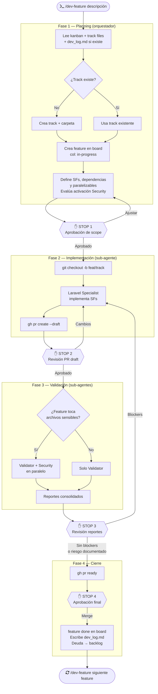
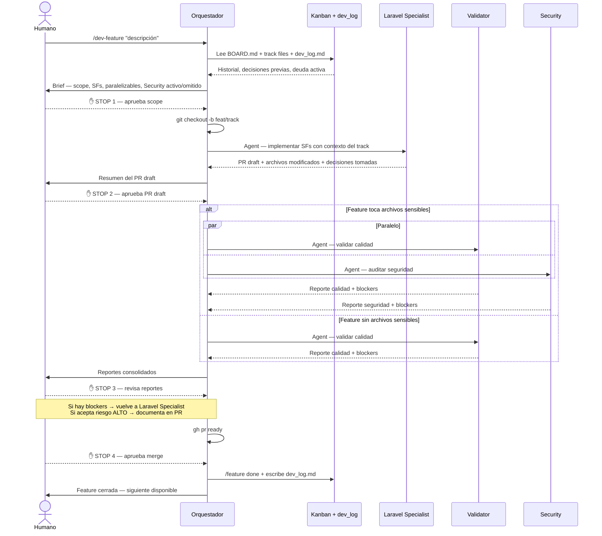

# Strategy: Multi-Agent Workflow

> Documento de referencia para el flujo de trabajo colaborativo entre sub-agentes especializados y revisiones humanas.

---

## Modelo conceptual

```
TRACK  (iniciativa completa, ej: language-config)
  ├── Feature #001  = un PR  ← /dev-feature lo maneja completo
  ├── Feature #002  = un PR  ← siguiente invocación
  └── Feature #003  = un PR

Dentro de cada feature:
  SF-01, SF-02...  = pasos de implementación internos al PR
```

**Un track** agrupa features relacionadas bajo una misma iniciativa. **Una feature** es la unidad de entrega: tiene scope definido, una rama git, un PR y pasa por el ciclo completo de agentes. Se itera feature a feature dentro del track.

---

## Diagrama de flujo



---

## Diagrama de secuencia



---

## Los cuatro agentes

### Agente 1 — Orquestador (`/dev-feature`)

Coordina el ciclo completo de una feature. No implementa ni audita: gestiona el flujo, construye el contexto para cada sub-agente y detiene la ejecución en cada checkpoint humano.

**Contexto propio:** estructura del kanban, reglas del ciclo, criterios de activación del Security Agent, formato del `dev_log.md`.

---

### Agente 2 — Planning (`/feature`)

Gestión pura del board Kanban. Opera standalone para consultar, mover o agregar features sin iniciar el ciclo de desarrollo.

**Contexto propio:** `.kanban/BOARD.md`, `.kanban/features/**/*.md`, `.kanban/tracks/*.md`, historial de decisiones arquitectónicas por track.

---

### Agente 3 — Laravel Specialist (`/laravel-specialist`)

Implementador. Opera como sub-agente lanzado por el Orquestador o standalone para implementar features ya definidas.

**Contexto propio:** arquitectura multi-tenant, sistema de rutas por atributos, capas de abstracción (BaseRepository, AdminBaseAdapter, BaseFormRequest), guards duales, reglas de migraciones central + tenant.

**Contexto compartido inyectado por el Orquestador:** reglas runtime críticas (orden de middlewares, UTC, chunk, guard iteration).

---

### Agente 4 — Validator (`/validator`)

Calidad técnica. Opera como sub-agente (siempre activo) o standalone sobre cualquier rama.

**Contexto propio:** dimensiones de evaluación (SOLID, patrones, abstracción, datos masivos, tests, convenciones), escala 1.0–5.0, criterio de blocker.

---

### Agente 5 — Security (`/security`)

Auditoría de seguridad. Opera como sub-agente **condicional** (solo si la feature toca archivos sensibles) o standalone.

**Criterio de activación:**
- `app/Http/Middleware/` o `bootstrap/app.php`
- archivos con auth / guard / policy / gate / role
- tenancy, impersonation
- FormRequests con campos de usuario o contraseña

**Contexto propio:** tenant bleeding, guards, mass assignment, injection, exposición de datos. Severidades: CRÍTICO / ALTO / MEDIO.

---

## Continuidad entre features — dev_log.md

El gap más crítico del sistema es la pérdida de contexto entre features del mismo track. El `dev_log.md` lo resuelve.

```
.kanban/features/{track}_track_{MM}_{YYYY}/
├── 01_nombre-feature.md      ← scope y análisis
├── 02_nombre-feature.md
└── dev_log.md                ← decisiones de implementación acumuladas
```

El Orquestador **lee** `dev_log.md` en Fase 1 y **escribe** una nueva entrada en Fase 4 post-merge:

```markdown
## Feature #001 — Migración campo locale (2026-04-12)
**Decisiones:** campo nullable para no romper usuarios existentes sin locale.
**Deuda aceptada:** sin índice en locale por ahora — volumen bajo.
**Afecta features siguientes:** SF de middleware debe leer locale con fallback explícito.
```

---

## Distribución de contexto

```
┌─────────────────────────────────────────────────────────────────┐
│                   CLAUDE.md (auto-cargado)                      │
│  Arquitectura general · Estructura de proyectos · Capas · Tests │
└────────────────────────────┬────────────────────────────────────┘
                             │ disponible en todos
              ┌──────────────┼──────────────────────┐
              │              │                      │
   ┌──────────▼──────┐  ┌────▼───────────┐  ┌──────▼──────────┐
   │  Laravel Spec.  │  │   Validator    │  │    Security     │
   │  CONTEXTO PROPIO│  │  CONTEXTO PROP │  │  CONTEXTO PROPIO│
   │                 │  │                │  │                 │
   │ Attr routing    │  │ SOLID rules    │  │ Tenant bleeding │
   │ Guards duales   │  │ Test convs.    │  │ Guard bypass    │
   │ Migr c+tenant   │  │ Nota 1.0–5.0   │  │ Injection/expo  │
   │ BaseRepo/Svc    │  │ Blocker critr. │  │ Severidades     │
   └─────────────────┘  └────────────────┘  └─────────────────┘

              ┌──────────────────────────────────────┐
              │   INYECTADO POR EL ORQUESTADOR        │
              │  (solo lo que no cubre CLAUDE.md)     │
              │                                      │
              │ Orden de middlewares runtime          │
              │ Guard iteration pattern               │
              │ UTC / display rule                    │
              │ chunk() rule                          │
              └──────────────────────────────────────┘
```

---

## Checkpoints humanos — resumen

| Stop | Momento | Qué decide el humano | Sin aprobación |
|------|---------|----------------------|----------------|
| 1 | Post-planning | Scope, SFs, rama | No se abre la rama |
| 2 | Post-PR draft | Revisión de código | No corre validación |
| 3 | Post-reportes | Blockers, aceptación de riesgo | No se marca ready |
| 4 | Pre-merge | Aprobación final | No se hace merge |

**Lo que los agentes nunca hacen sin aprobación humana:**
- Merge a `main`
- `push --force`
- Eliminar ramas o archivos
- Ignorar un blocker CRÍTICO o ALTO sin documentación del humano

---

## Comandos disponibles

| Comando | Uso | Tipo |
|---------|-----|------|
| `/dev-feature "desc"` | Ciclo completo de una feature | Orquestador |
| `/feature board` | Ver tablero Kanban | Standalone |
| `/feature add` | Agregar feature al board | Standalone |
| `/laravel-specialist` | Implementar sin ciclo completo | Standalone / sub-agente |
| `/validator` | Auditar calidad de una rama | Standalone / sub-agente |
| `/security` | Auditar seguridad de una rama | Standalone / sub-agente |
